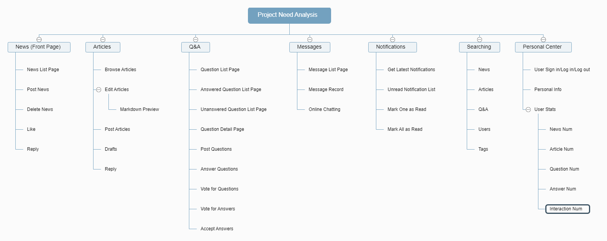
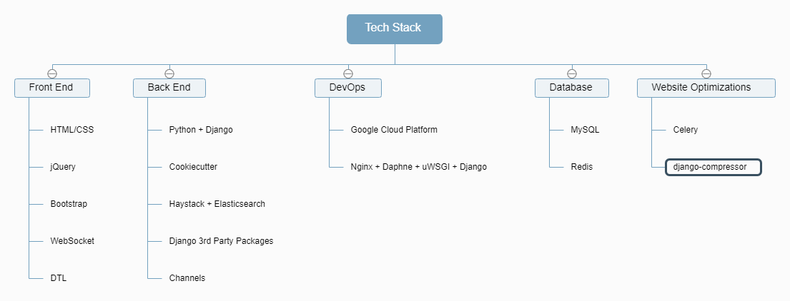

zanhu
=====

A Q&A website

.. image:: https://img.shields.io/badge/built%20with-Cookiecutter%20Django-ff69b4.svg
     :target: https://github.com/pydanny/cookiecutter-django/
     :alt: Built with Cookiecutter Django
.. image:: https://img.shields.io/badge/code%20style-black-000000.svg
     :target: https://github.com/ambv/black
     :alt: Black code style

Intro
--------

Zanhu is an enterprise level Q&A website, similar to Quora and Stackoverflow. Starting from actual need analysis, this project implements the prevailing functions of Q&A website, including news, articles, q&a, messages, notifications, searching and personal center.

Project Management
--------------

Needs Analysis
^^^^^^^^^^^^^^^^^^^^^

Tech Stack
^^^^^^^^^^^

Test coverage
^^^^^^^^^^^^^

To run the tests, check your test coverage, and generate an HTML coverage report::

    $ coverage run -m pytest
    $ coverage html
    $ open htmlcov/index.html

Running tests with py.test
~~~~~~~~~~~~~~~~~~~~~~~~~~

::

  $ pytest

